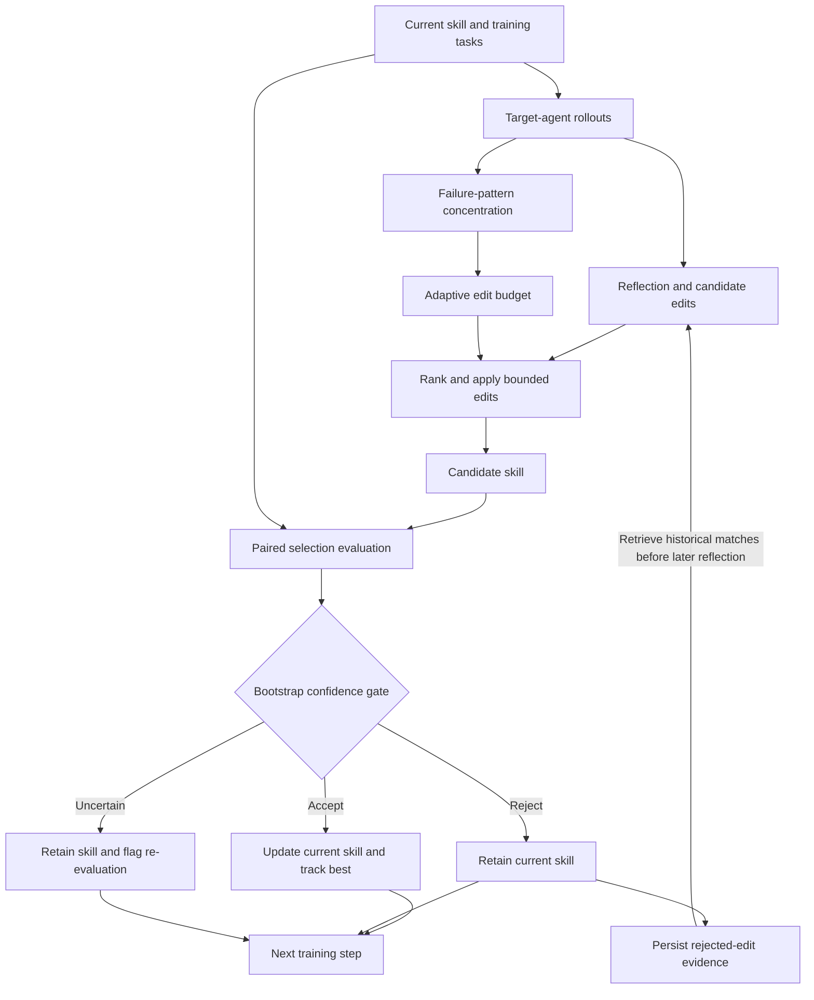

<div align="center">

# CAM-SkillOpt

**Confidence-Aware and Memory-Guided Adaptive Optimization for Self-Evolving Agent Skills**

[](pyproject.toml)
[](https://github.com/microsoft/SkillOpt)
[](LICENSE)

[Overview](#overview) · [Method](#method) · [Experimental design](#experimental-design) · [Reproduction](#reproduction) · [License](#license)

</div>

## Overview

CAM-SkillOpt studies the reliability of textual skill optimization for large language model agents. A skill document provides reusable instructions to a frozen target model; an optimizer model proposes edits from scored task trajectories. The central question is whether uncertainty in candidate evaluation, the size of each edit, and evidence from earlier rejected edits can inform more reliable skill updates.

Built on [SkillOpt](https://github.com/microsoft/SkillOpt), CAM-SkillOpt introduces a paired bootstrap gate, a confidence-guided adaptive edit budget, and persistent rejected-edit memory. The optimized artifact is a Markdown skill document. Model weights remain fixed throughout training.

This repository contains the CAM implementation, baseline and ablation configurations, data-materialization scripts, and selected experiment records. The current empirical evidence consists of offline module checks and small-scale SpreadsheetBench runs. The broader benchmark comparison described below remains a research protocol, with performance gains yet to be established.

Latest implementation checkpoint: [Persistent Memory integration and offline acceptance, 2026-09-09](reports/stage12/recovery_20260909/MEMORY_STEP1_REPORT.md). The CAM Gate/final-best and token-accounting fixes remain pending; no new live P0 or formal ablation was launched at this checkpoint.

## Method

### Optimization workflow



*The diagram summarizes the intended CAM path. Persistent Memory retrieval is now injected before training reflection and audited against actual optimizer prompts; this has passed synthetic offline tests, not a new live benchmark run. The previously identified final-best path outside CAM Gate remains a pending fix.*

### Core components

| Component | Mechanism | Implementation |
| --- | --- | --- |
| **Paired Bootstrap Gate** | Resamples per-task score differences between the current and candidate skills on the same selection examples. Accepts, rejects, or flags an uncertain update from the confidence interval. | [`bootstrap_gate.py`](skillopt/cam/bootstrap_gate.py) |
| **Adaptive Edit Budget** | Measures the concentration of observed failure patterns and maps it to a bounded number of edits. Concentrated failures receive a larger edit budget. | [`adaptive_budget.py`](skillopt/cam/adaptive_budget.py) |
| **Persistent Rejected-Edit Memory** | Stores rejected edits, their failure contexts, and observed score changes across epochs. A deterministic lexical retriever ranks records by similarity weighted by the magnitude of the score change. | [`rejected_memory.py`](skillopt/cam/rejected_memory.py) |

For paired score differences $d_i = s_i^{\mathrm{candidate}} - s_i^{\mathrm{current}}$, the gate estimates a percentile bootstrap interval $[L, U]$ for the mean improvement. It accepts when $L > \delta$, rejects when $U < -\delta$, and otherwise returns `re_evaluate`, where $\delta$ is the configured meaningful-improvement threshold.

The adaptive budget uses failure concentration $c = 1 - H(p)/\log K$, where $p$ is the distribution over $K$ observed failure categories. It maps $c$ linearly to the configured integer budget range, using half-up rounding. An empty failure set gives $c = 0$; a single observed category gives $c = 1$.

**Implementation scope.** In the current [trainer](skillopt/engine/trainer.py), an uncertain gate decision retains the current skill and records `cam_re_evaluate`; it does not automatically collect additional validation examples. If paired scores are unavailable or have unequal lengths, the trainer records a fallback to the baseline gate. Persistent memory is written on rejected updates and retrieved before later training reflection, using only strictly earlier global steps from the same benchmark. Retrieval, hits, request injection, and completed nonempty responses are recorded separately. These distinctions matter when interpreting a CAM-Full run or a memory ablation.

## Experimental design

### Compared methods

The SpreadsheetBench configurations share a common base and expose the CAM components independently.

| Method | Configuration | Purpose |
| --- | --- | --- |
| Static skill | Evaluate the [initial skill](skillopt/envs/spreadsheetbench/skills/initial.md) with [`eval_only.py`](scripts/eval_only.py) | Reference performance before optimization |
| SkillOpt | [`spreadsheetbench_skillopt_baseline.yaml`](configs/cam_experiments/spreadsheetbench_skillopt_baseline.yaml) | Skill optimization with CAM disabled |
| CAM-Full | [`spreadsheetbench_cam_full.yaml`](configs/cam_experiments/spreadsheetbench_cam_full.yaml) | Enable all three CAM switches, within the implementation scope above |
| No-Bootstrap | [`spreadsheetbench_cam_no_bootstrap.yaml`](configs/cam_experiments/spreadsheetbench_cam_no_bootstrap.yaml) | Disable the paired bootstrap gate |
| No-Adaptive-Budget | [`spreadsheetbench_cam_no_adaptive_budget.yaml`](configs/cam_experiments/spreadsheetbench_cam_no_adaptive_budget.yaml) | Disable confidence-guided edit allocation |
| No-Memory | [`spreadsheetbench_cam_no_memory.yaml`](configs/cam_experiments/spreadsheetbench_cam_no_memory.yaml) | Disable persistent storage, retrieval and injection; the baseline epoch-local step buffer remains enabled |

### Default CAM parameters

| Parameter | Configuration key | Setting |
| --- | --- | ---: |
| Bootstrap confidence level | `cam.confidence_level` | 0.95 |
| Bootstrap resamples | `cam.bootstrap_samples` | 10,000 |
| Meaningful-improvement threshold | `cam.meaningful_improvement` | 0.0 |
| Minimum edit budget | `cam.min_budget` | 2 |
| Maximum edit budget | `cam.max_budget` | 8 |
| Bootstrap random seed | `cam.seed` | 42 |

These values are defined in the [CAM-Full configuration](configs/cam_experiments/spreadsheetbench_cam_full.yaml). Training, model, and environment settings are inherited from the [SpreadsheetBench configuration](configs/spreadsheetbench/default.yaml) and the [shared defaults](configs/_base_/default.yaml); command-line overrides are part of each run's protocol.

### Planned benchmark protocol

The [experiment plan](docs/experiments/CAM_CODEX_CLI_EXPERIMENT_PLAN.md) specifies SearchQA, DocVQA, and SpreadsheetBench, with Static, SkillOpt, and CAM-Full evaluated for three target models. It also specifies three SpreadsheetBench component ablations. This is a planned matrix of 27 main comparison cells and 3 ablation cells, rather than a completed results table.

Comparisons should hold the data splits, initial skill, target and optimizer models, execution harness, training schedule, and seed constant. Task scores should be reported alongside accepted and rejected updates, valid patch counts, model calls, tokens, runtime, and execution failures. A within-run bootstrap gate is not a substitute for uncertainty estimates across independent training runs.

## Available experimental evidence

The September 9 validity audit established that the recent Stage 12 CAM-Full runs, three ablations, P1/P2 probes, and supplementary evaluations were contaminated by Codex authentication failures. Their saved zero scores are **not valid benchmark measurements** and must not be interpreted as negative results for the method. CAM-Full is marked `invalid_auth`; the ablations retain the requested `validity_pending_diagnosis` tracking status with confirmed authentication-failure evidence and `paper_eligible=false`.

| Historical supplementary evaluation | Attempted tasks | Validity | Record (diagnostic only) |
| --- | ---: | --- | --- |
| Selection (`valid_seen`) | 8 | Invalid: authentication failure | [Original summary](reports/stage12/eval_only_cam_full_fix2_best_valid_seen_8_w1_a1/eval_summary.json) |
| Test (`valid_unseen`) | 8 | Invalid: authentication failure | [Original summary](reports/stage12/eval_only_cam_full_fix2_best_valid_unseen_8_w1_a1/eval_summary.json) |

The [validity correction](reports/stage12/recovery_20260909/VALIDITY_CORRECTION.md) preserves the audit evidence without rewriting raw historical results. A fresh four-sample P0 has now completed with verified end-to-end evidence: 24 scored task evaluations, two reflection patches with three edits, one adaptive-budget computation and one CAM Gate decision. Baseline, best and final test scores are all 0.25; no test improvement was observed. Four network recovery notices across three target requests were retained, with no terminal infrastructure failure. See the [final recovery report](reports/stage12/recovery_20260909/P0_FINAL_REPORT.md) and [full recovery log](reports/stage12/recovery_20260909/RECOVERY_PROGRESS.md). This is an exploratory pipeline check, not a formal CAM ablation result or evidence of a performance advantage.

Before formal CAM-Full/No-Memory comparisons, persistent rejected-memory retrieval must also be wired into the training path and observed, rather than inferred from its configuration switch. The patch candidate was not accepted by CAM; this run's best skill came from the separate empty Slow Update placeholder/final-selection path. The [formal-experiment prerequisites](reports/stage12/recovery_20260909/FORMAL_EXPERIMENT_PREREQUISITES.md) document this distinction and the remaining memory, selection-policy and token-accounting work.

## Repository structure

```text
CAM-SkillOpt/
├── skillopt/
│   ├── cam/                       # Bootstrap gate, adaptive budget, and memory
│   ├── engine/trainer.py          # SkillOpt training loop with CAM integration
│   ├── envs/                      # Benchmark environments and initial skills
│   └── model/                     # Model backends and execution harnesses
├── configs/
│   ├── cam_experiments/           # CAM, baseline, ablation, and provider configs
│   └── spreadsheetbench/          # Shared SpreadsheetBench settings
├── scripts/                       # Training, evaluation, data, and preflight tools
├── experiments/
│   └── cam_offline_sanity.py       # Synthetic module verification
├── data/                          # Lightweight benchmark split manifests
├── reports/                       # Selected experiment records and summaries
├── docs/                          # Framework guides and experiment protocol
├── UPSTREAM_README.md             # Preserved SkillOpt documentation
├── pyproject.toml
├── requirements.txt
├── LICENSE
└── README.md
```

## Installation

Python 3.10 or later is required. Install this checkout to use the CAM implementation.

```bash
git clone https://github.com/Lutra11/CAM-SkillOpt.git
cd CAM-SkillOpt
python -m venv .venv
```

Activate the environment in your shell:

| Shell | Command |
| --- | --- |
| Windows PowerShell | `.\.venv\Scripts\Activate.ps1` |
| Linux / macOS | `source .venv/bin/activate` |

```bash
python -m pip install --upgrade pip
python -m pip install -e .
```

The core dependencies include NumPy, PyYAML, openpyxl, and the model-client libraries listed in [`pyproject.toml`](pyproject.toml). Live experiments also require access to the model provider or execution harness selected in the configuration.

## Reproduction

Run the following commands from the repository root with the environment activated. Commands written on one line work in both PowerShell and Bash.

### 1. Verify the CAM modules offline

```bash
python -m experiments.cam_offline_sanity
```

This check uses fixed synthetic outcomes to exercise the bootstrap gate, adaptive budget, and persistent-memory retrieval. It writes `outputs/cam_offline_sanity/report.json`. No model credentials or benchmark files are required. The output verifies module behavior and is not a benchmark result.

### 2. Prepare SpreadsheetBench

Obtain the SpreadsheetBench Verified 400 archive separately and place it at `data/spreadsheetbench_verified_400.tar.gz`. The committed [split manifests](data/spreadsheetbench_id_split) identify tasks; the archive supplies the full task records and workbooks.

```bash
python scripts/materialize_spreadsheetbench.py --archive data/spreadsheetbench_verified_400.tar.gz --output-split-dir data/spreadsheetbench_split
```

The materializer validates task records and workbook pairs, then writes `train`, `valid_seen`, and `valid_unseen` splits. Inspect `outputs/stage6_data_materialization/report.json` and confirm that `status` is `READY` before training. The default extracted payload directory is `data/spreadsheetbench_verified_400`, matching `env.data_root` in the configuration.

### 3. Configure model access

For a DeepSeek-only smoke run, copy [`.env.deepseek_glm.example`](.env.deepseek_glm.example) to `.env` and set **both** `OPTIMIZER_AZURE_OPENAI_API_KEY` and `TARGET_AZURE_OPENAI_API_KEY` to your DeepSeek API key. The [DeepSeek-only configuration](configs/cam_experiments/spreadsheetbench_cam_full_deepseek_only.yaml) selects `deepseek-chat` for both roles. For separate providers, use the [DeepSeek/GLM configuration](configs/cam_experiments/spreadsheetbench_cam_full_deepseek_glm.yaml) and the corresponding keys.

Check the DeepSeek-only configuration:

```bash
python scripts/cam_stage10_compat_preflight.py --config configs/cam_experiments/spreadsheetbench_cam_full_deepseek_only.yaml --deepseek-only
```

This command checks configuration and credential presence. Add `--probe` to make a small live connectivity request. Local `.env` files are excluded from version control.

### 4. Run a small training check

```bash
python scripts/train.py --config configs/cam_experiments/spreadsheetbench_cam_full_deepseek_only.yaml --cfg-options train.num_epochs=1 train.train_size=8 train.batch_size=4 gradient.minibatch_size=2 gradient.merge_batch_size=2 gradient.analyst_workers=1 gradient.max_analyst_rounds=1 evaluation.sel_env_num=4 evaluation.test_env_num=4 env.workers=1 env.out_root=outputs/smoke/cam_full_deepseek
```

This reduced run checks the model-backed training path. It is separate from the planned benchmark protocol and the recorded Codex-backed Stage 12 experiment. For a matched baseline check, use [`spreadsheetbench_baseline_deepseek_only.yaml`](configs/cam_experiments/spreadsheetbench_baseline_deepseek_only.yaml) with the same overrides and a separate output directory.

### 5. Evaluate a saved skill

After a completed training run, evaluate its saved skill on the held-out split. Unlike the training entry point, `eval_only.py` reads credentials from the process environment and does not load `.env`. Set the same keys in your current shell first.

<details>
<summary>Windows PowerShell</summary>

```powershell
$env:OPTIMIZER_AZURE_OPENAI_API_KEY = "your-deepseek-api-key"
$env:TARGET_AZURE_OPENAI_API_KEY = $env:OPTIMIZER_AZURE_OPENAI_API_KEY
```

</details>

<details>
<summary>Linux / macOS</summary>

```bash
export OPTIMIZER_AZURE_OPENAI_API_KEY="your-deepseek-api-key"
export TARGET_AZURE_OPENAI_API_KEY="$OPTIMIZER_AZURE_OPENAI_API_KEY"
```

</details>

```bash
python scripts/eval_only.py --config configs/cam_experiments/spreadsheetbench_cam_full_deepseek_only.yaml --skill outputs/smoke/cam_full_deepseek/best_skill.md --split valid_unseen --cfg-options evaluation.test_env_num=4 env.workers=1 env.out_root=outputs/eval/cam_full_deepseek
```

The [training guide](docs/guide/training-loop.md), [configuration reference](docs/reference/config.md), and [experiment plan](docs/experiments/CAM_CODEX_CLI_EXPERIMENT_PLAN.md) provide the extended workflow. Some experiment reports retain their original Chinese lab notes.

## Reproducibility and data availability

- **Selection and test separation.** Candidate selection uses the selection split; the held-out test split is reserved for evaluation.
- **Recorded settings.** Retain the resolved configuration, skill versions, training history, evaluation summaries, runtime, and usage statistics for each comparison.
- **Incomplete runs.** Record missing summaries, invalid patches, interruptions, and independent supplementary evaluations explicitly.
- **Independent outputs.** Use a distinct `env.out_root` for each method, seed, and protocol revision.
- **Data access.** The repository distributes lightweight split manifests and selected reports. Benchmark archives, extracted workbooks, local environments, and raw model traces are prepared or generated locally.

## Acknowledgements

CAM-SkillOpt extends [Microsoft SkillOpt](https://github.com/microsoft/SkillOpt). The original framework documentation is preserved in [`UPSTREAM_README.md`](UPSTREAM_README.md). SpreadsheetBench supplies the spreadsheet task setting used in the current experiments. The presentation of this README follows the research-oriented organization of [SHDMS-ABC](https://github.com/Lutra11/SHDMS-ABC).

## License

This project is released under the [MIT License](LICENSE). The license retains the Microsoft Corporation copyright notice for the upstream SkillOpt code and includes the CAM-SkillOpt contributors. External benchmarks and third-party dependencies remain subject to their respective licenses.
