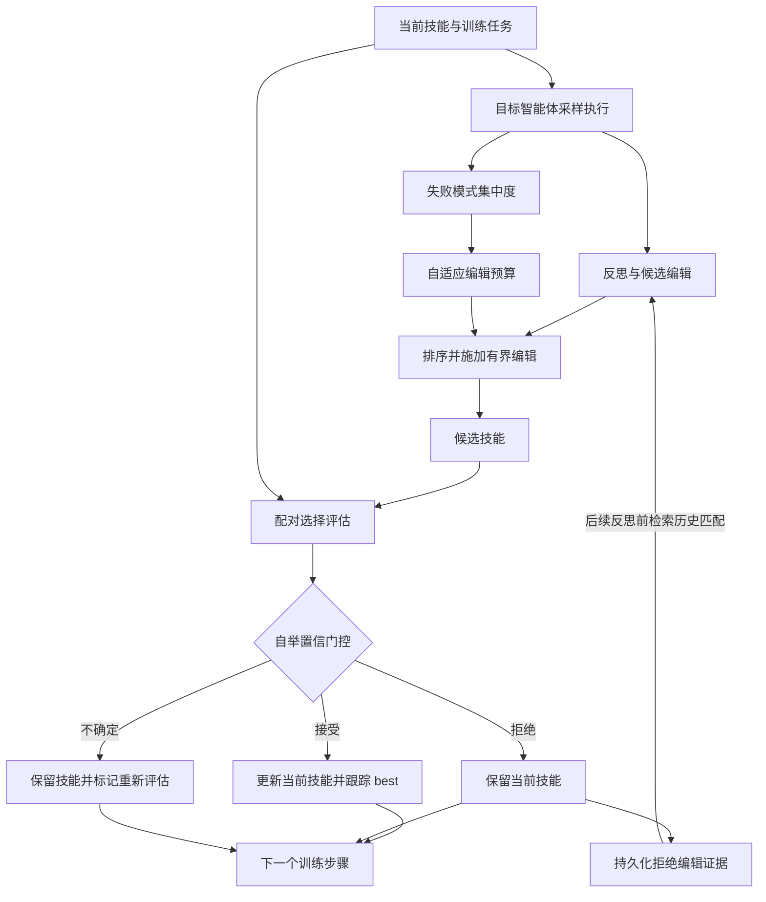

<div align="center">

# CAM-SkillOpt

**面向自演化智能体技能的置信度感知与记忆引导自适应优化**

[](pyproject.toml)
[](https://github.com/microsoft/SkillOpt)
[](LICENSE)

[English](README.md) · **简体中文**

[概述](#概述) · [方法](#方法) · [实验设计](#实验设计) · [复现](#复现) · [许可证](#许可证)

</div>

## 概述

CAM-SkillOpt 研究面向大语言模型智能体的文本化技能优化的可靠性。技能文档为冻结的目标模型提供可复用的指令；优化器模型则依据带评分的任务轨迹提出编辑。核心问题是：候选评估中的不确定性、每次编辑的规模，以及此前被拒绝的编辑所提供的证据，能否支撑更可靠的技能更新。

CAM-SkillOpt 构建于 [SkillOpt](https://github.com/microsoft/SkillOpt) 之上，引入了配对自举门控、置信度引导的自适应编辑预算，以及持久化的拒绝编辑记忆。优化产物是一份 Markdown 技能文档。整个训练过程中模型权重保持不变。

本仓库包含 CAM 实现、基线与消融配置、数据物化脚本，以及部分实验记录。当前的经验证据由离线模块检查与较小规模的 SpreadsheetBench 运行组成。下文描述的更广泛基准对比仍是一份研究协议，其性能收益尚待确立。

最新实现检查点：[请求/Token 计量验收，2026-09-10](reports/stage12/recovery_20260909/TOKEN_ACCOUNTING_STEP3_REPORT.md)：220 项离线测试全部通过；一次只读的历史回放核对了 27 次 CLI 调用与 384,380 个 token，且未改动原始证据。此项工作承接[统一 CAM 门控](reports/stage12/recovery_20260909/GATE_STEP2_REPORT.md)与[持久化记忆集成](reports/stage12/recovery_20260909/MEMORY_STEP1_REPORT.md)。未启动新的实机 P0 或正式消融；冻结代码后的 n=4 P0 仍是下一步工作。

最新恢复尝试：[Step 4 fix1，2026-09-10](reports/stage12/recovery_20260910/STEP4_FIX1_REPORT.md)。带前缀的 stderr 重连识别问题已修复；236 项限定范围的离线测试全部通过，源码已重新冻结。四次鉴权探测与单样本验证均通过。P0 完成了一个训练步骤，产生了真实的 CAM Gate 决策与自适应预算，但在基线测试期间的第三次重连提示处停止（39 秒）。候选技能 0.50 的选择得分未能越过不确定门控：best 仍停留在初始技能。该次运行为 `invalid_infra`，并非完整的基准结果；Step 5 仍然受阻。[此前失败的鉴权尝试](reports/stage12/recovery_20260910/STEP4_REPORT.md)保持原样存档。

## 方法

### 优化工作流



*该图概括了 CAM 的路径。记忆检索/注入与统一的 current/best 门控已通过合成离线测试，但尚未经过新的实机基准运行。启用 CAM 自举时，patch、appendix、slow-update 与 final-best 状态转换都需要带 ID 配对的选择证据。空的第一个 epoch 占位符不再改变技能。*

### 核心组件

| 组件 | 机制 | 实现 |
| --- | --- | --- |
| **配对自举门控** | 在同一批选择样本上，对当前技能与候选技能之间逐任务的得分差进行重采样。依据置信区间接受、拒绝或将更新标记为不确定。 | [`bootstrap_gate.py`](skillopt/cam/bootstrap_gate.py) |
| **自适应编辑预算** | 度量已观测失败模式的集中程度，并将其映射为有界的编辑数量。失败越集中，编辑预算越大。 | [`adaptive_budget.py`](skillopt/cam/adaptive_budget.py) |
| **持久化拒绝编辑记忆** | 跨 epoch 存储被拒绝的编辑、其失败上下文以及观测到的得分变化。确定性词法检索器按相似度对记录排序，并以得分变化幅度加权。 | [`rejected_memory.py`](skillopt/cam/rejected_memory.py) |

对于配对得分差 $d_i = s_i^{\mathrm{candidate}} - s_i^{\mathrm{current}}$，门控为平均改进量估计一个百分位自举区间 $[L, U]$。当 $L > \delta$ 时接受，当 $U < -\delta$ 时拒绝，否则返回 `re_evaluate`，其中 $\delta$ 是配置的“有意义改进”阈值。

自适应预算使用失败集中度 $c = 1 - H(p)/\log K$，其中 $p$ 是 $K$ 个已观测失败类别上的分布。它将 $c$ 线性映射到配置的整数预算区间，采用四舍五入（half-up）。空失败集给出 $c = 0$；仅观测到一个类别时给出 $c = 1$。

**实现范围。** 在当前 [trainer](skillopt/engine/trainer.py) 中，门控的不确定决策会保留受影响的 current/best 状态并记录一个待定候选；它不会自动收集额外的验证样本，也不会重试直到接受。启用 CAM 自举时，遇到不完整、不匹配或无效的选择证据会被直接拒绝，而不会退回到标量门控。关闭该门控需要显式的非 CAM 自举配置。持久化记忆在步骤更新被拒绝时写入，并在后续训练反思之前检索，且仅使用同一基准中严格更早的全局步骤。检索、命中、请求注入与完成的非空响应分别记录。在扩展实验之前，真实运行必须展示出自然的记忆写入、随后的命中以及实际的 prompt 注入；合成测试不满足该证据要求。

## 实验设计

### 对比方法

SpreadsheetBench 的各配置共享同一基础配置，并各自独立地暴露 CAM 组件。

| 方法 | 配置 | 目的 |
| --- | --- | --- |
| 静态技能 | 使用 [`eval_only.py`](scripts/eval_only.py) 评估[初始技能](skillopt/envs/spreadsheetbench/skills/initial.md) | 优化前的参考性能 |
| SkillOpt | [`spreadsheetbench_skillopt_baseline.yaml`](configs/cam_experiments/spreadsheetbench_skillopt_baseline.yaml) | 禁用 CAM 的技能优化 |
| CAM-Full | [`spreadsheetbench_cam_full.yaml`](configs/cam_experiments/spreadsheetbench_cam_full.yaml) | 在上述实现范围内开启全部三个 CAM 开关 |
| No-Bootstrap | [`spreadsheetbench_cam_no_bootstrap.yaml`](configs/cam_experiments/spreadsheetbench_cam_no_bootstrap.yaml) | 禁用配对自举门控 |
| No-Adaptive-Budget | [`spreadsheetbench_cam_no_adaptive_budget.yaml`](configs/cam_experiments/spreadsheetbench_cam_no_adaptive_budget.yaml) | 禁用置信度引导的编辑分配 |
| No-Memory | [`spreadsheetbench_cam_no_memory.yaml`](configs/cam_experiments/spreadsheetbench_cam_no_memory.yaml) | 禁用持久化存储、检索与注入；基线中 epoch 本地的步骤缓冲仍然启用 |

### 默认 CAM 参数

| 参数 | 配置键 | 取值 |
| --- | --- | ---: |
| 自举置信水平 | `cam.confidence_level` | 0.95 |
| 自举重采样次数 | `cam.bootstrap_samples` | 10,000 |
| 有意义改进阈值 | `cam.meaningful_improvement` | 0.0 |
| 最小编辑预算 | `cam.min_budget` | 2 |
| 最大编辑预算 | `cam.max_budget` | 8 |
| 自举随机种子 | `cam.seed` | 42 |

这些取值定义在 [CAM-Full 配置](configs/cam_experiments/spreadsheetbench_cam_full.yaml)中。训练、模型与环境设置继承自 [SpreadsheetBench 配置](configs/spreadsheetbench/default.yaml)与[共享默认值](configs/_base_/default.yaml)；命令行覆盖是每次运行协议的一部分。

### 计划中的基准协议

[实验计划](docs/experiments/CAM_CODEX_CLI_EXPERIMENT_PLAN.md)指定了 SearchQA、DocVQA 与 SpreadsheetBench，并为三个目标模型评估 Static、SkillOpt 与 CAM-Full。它还指定了三个 SpreadsheetBench 组件消融。这是一份计划中的 27 个主对比单元与 3 个消融单元的矩阵，而非已完成的结果表。

对比应保持数据划分、初始技能、目标模型与优化器模型、执行框架、训练调度和随机种子不变。任务得分应与接受与拒绝的更新数、有效补丁数、模型调用次数、token 数、运行时以及执行失败一并报告。单次运行内部的自举门控不能替代跨独立训练运行的不确定性估计。

## 已有实验证据

9 月 9 日的有效性审计确认，近期的 Stage 12 CAM-Full 运行、三个消融、P1/P2 探测以及补充评估均受到 Codex 鉴权失败的污染。其保存的零分**不是有效的基准测量**，不得被解读为对该方法的负面结果。CAM-Full 被标记为 `invalid_auth`；各消融保留所要求的 `validity_pending_diagnosis` 跟踪状态，并附有已确认的鉴权失败证据与 `paper_eligible=false`。

| 历史补充评估 | 尝试任务数 | 有效性 | 记录（仅供诊断） |
| --- | ---: | --- | --- |
| 选择集（`valid_seen`） | 8 | 无效：鉴权失败 | [原始摘要](reports/stage12/eval_only_cam_full_fix2_best_valid_seen_8_w1_a1/eval_summary.json) |
| 测试集（`valid_unseen`） | 8 | 无效：鉴权失败 | [原始摘要](reports/stage12/eval_only_cam_full_fix2_best_valid_unseen_8_w1_a1/eval_summary.json) |

[有效性更正](reports/stage12/recovery_20260909/VALIDITY_CORRECTION.md)保留了审计证据，而未改写原始历史结果。一次全新的四样本 P0 现已完成并具备经核验的端到端证据：24 次带评分的任务评估、两次共含三个编辑的反思补丁、一次自适应预算计算与一次 CAM Gate 决策。基线、best 与最终测试得分均为 0.25；未观测到测试提升。三次目标请求中出现的四次网络恢复提示被保留，且没有出现终结性的基础设施故障。参见[最终恢复报告](reports/stage12/recovery_20260909/P0_FINAL_REPORT.md)与[完整恢复日志](reports/stage12/recovery_20260909/RECOVERY_PROGRESS.md)。这是一次探索性的流水线检查，而非正式的 CAM 消融结果，也不是性能优势的证据。

在正式的 CAM-Full/No-Memory 对比之前，持久化拒绝记忆的检索还必须接入训练路径并被实际观测到，而不是仅从其配置开关推断。该 patch 候选未被 CAM 接受；本次运行的 best 技能来自另一条空的 Slow Update 占位/最终选择路径。[正式实验前置条件](reports/stage12/recovery_20260909/FORMAL_EXPERIMENT_PREREQUISITES.md)记录了这一区别，以及剩余的记忆、选择策略与 token 计量工作。

## 仓库结构

```text
CAM-SkillOpt/
├── skillopt/
│   ├── cam/                       # 自举门控、自适应预算与记忆
│   ├── engine/trainer.py          # 集成 CAM 的 SkillOpt 训练循环
│   ├── envs/                      # 基准环境与初始技能
│   └── model/                     # 模型后端与执行框架
├── configs/
│   ├── cam_experiments/           # CAM、基线、消融与提供商配置
│   └── spreadsheetbench/          # 共享的 SpreadsheetBench 设置
├── scripts/                       # 训练、评估、数据与预检工具
├── experiments/
│   └── cam_offline_sanity.py      # 合成模块验证
├── data/                          # 轻量级基准划分清单
├── reports/                       # 部分实验记录与摘要
├── docs/                          # 框架指南与实验协议
├── UPSTREAM_README.md             # 保留的 SkillOpt 文档
├── pyproject.toml
├── requirements.txt
├── LICENSE
├── README.md
└── README.zh-CN.md                # 中文文档（本文件）
```

## 安装

需要 Python 3.10 或更高版本。请安装本检出以使用 CAM 实现。

### 方式 A：使用 uv（推荐）

仓库已提交 [`uv.lock`](uv.lock) 与 [`.python-version`](.python-version)，因此用 [uv](https://docs.astral.sh/uv/) 一条命令即可复现该环境。先安装 uv：

| 平台 | 命令 |
| --- | --- |
| Windows PowerShell | `powershell -ExecutionPolicy ByPass -c "irm https://astral.sh/uv/install.ps1 \| iex"` |
| Linux / macOS | `curl -LsSf https://astral.sh/uv/install.sh \| sh` |

若更倾向使用包管理器，`pipx install uv` 或 `python -m pip install uv` 也可以。

然后在仓库根目录执行：

```bash
git clone https://github.com/Lutra11/CAM-SkillOpt.git
cd CAM-SkillOpt
uv sync
```

`uv sync` 会读取 `.python-version`（3.12），在需要时下载匹配的解释器，创建 `.venv`，并以可编辑模式安装 CAM 实现及锁定版本的核心依赖。项目已通过 [`pyproject.toml`](pyproject.toml) 中的 `[tool.uv]` 配置了 PyPI 镜像。

无需手动激活环境 —— 在命令前加上 `uv run` 即可：

```bash
uv run python -m experiments.cam_offline_sanity
```

可选依赖组通过 `--extra` 安装：

```bash
uv sync --extra dev       # ruff 与 pytest
uv sync --all-extras      # 全部可选依赖组
```

若想在 uv 创建的环境中改用普通 `pip`（不使用锁文件）：

```bash
uv venv
uv pip install -e .
```

> **Windows 下的 `Failed to hardlink files` 警告。** uv 会把缓存中的 wheel 以硬链接方式放入环境。当缓存与检出位于不同磁盘卷时（例如缓存在 `C:`，而本仓库在 `D:`），硬链接无法建立，uv 会改为完整复制每个 wheel。安装依然成功，只是更慢、占用更多磁盘。可用以下方式消除该警告：
>
> ```powershell
> $env:UV_LINK_MODE = "copy"
> ```
>
> 或者把缓存放到与检出相同的磁盘卷上，从而保留硬链接：
>
> ```powershell
> $env:UV_CACHE_DIR = "D:\uv-cache"
> ```
>
> 在 Linux 与 macOS 上，当缓存位于不同挂载点时会出现同样的提示，可改用 `export UV_LINK_MODE=copy`，或设置 `export UV_CACHE_DIR=/path/on/the/same/mount`。

### 方式 B：venv + pip

```bash
git clone https://github.com/Lutra11/CAM-SkillOpt.git
cd CAM-SkillOpt
python -m venv .venv
```

在你的 shell 中激活该环境（若你更愿意手动激活 `.venv` 而不是使用 `uv run`，该表同样适用于方式 A）：

| Shell | 命令 |
| --- | --- |
| Windows PowerShell | `.\.venv\Scripts\Activate.ps1` |
| Linux / macOS | `source .venv/bin/activate` |

```bash
python -m pip install --upgrade pip
python -m pip install -e .
```

核心依赖包括 NumPy、PyYAML、openpyxl，以及 [`pyproject.toml`](pyproject.toml) 中列出的模型客户端库。实机实验还需要访问配置中所选的模型提供商或执行框架。

## 复现

请在仓库根目录、且环境已激活的情况下运行以下命令。写在同一行内的命令在 PowerShell 与 Bash 中均可使用。若采用方式 A，把命令写成 `uv run python ...` 即可在 uv 管理的环境中运行，无需激活。

### 1. 离线验证 CAM 模块

```bash
python -m experiments.cam_offline_sanity
```

该检查使用固定的合成结果来演练自举门控、自适应预算与持久化记忆检索。它会写出 `outputs/cam_offline_sanity/report.json`。此过程不需要模型凭据或基准文件。其输出验证的是模块行为，并不是基准结果。

### 2. 准备 SpreadsheetBench

另行获取 SpreadsheetBench Verified 400 归档，并将其放置到 `data/spreadsheetbench_verified_400.tar.gz`。仓库中提交的[划分清单](data/spreadsheetbench_id_split)用于标识任务；归档则提供完整的任务记录与工作簿。

```bash
python scripts/materialize_spreadsheetbench.py --archive data/spreadsheetbench_verified_400.tar.gz --output-split-dir data/spreadsheetbench_split
```

物化脚本会校验任务记录与工作簿配对，然后写出 `train`、`valid_seen` 与 `valid_unseen` 划分。请在训练前检查 `outputs/stage6_data_materialization/report.json`，并确认 `status` 为 `READY`。默认的解压产物目录是 `data/spreadsheetbench_verified_400`，与配置中的 `env.data_root` 一致。

### 3. 配置模型访问

对于仅使用 DeepSeek 的冒烟运行，请将 [`.env.deepseek_glm.example`](.env.deepseek_glm.example) 复制为 `.env`，并把 `OPTIMIZER_AZURE_OPENAI_API_KEY` 与 `TARGET_AZURE_OPENAI_API_KEY` **两者**都设为你的 DeepSeek API key。[仅 DeepSeek 配置](configs/cam_experiments/spreadsheetbench_cam_full_deepseek_only.yaml)为两个角色都选择 `deepseek-chat`。若两个角色使用不同提供商，请使用 [DeepSeek/GLM 配置](configs/cam_experiments/spreadsheetbench_cam_full_deepseek_glm.yaml)及相应的 key。

检查仅 DeepSeek 配置：

```bash
python scripts/cam_stage10_compat_preflight.py --config configs/cam_experiments/spreadsheetbench_cam_full_deepseek_only.yaml --deepseek-only
```

该命令检查配置与凭据是否存在。加上 `--probe` 会发起一次小规模的实机连通性请求。本地 `.env` 文件已被排除在版本控制之外。

### 4. 运行一次小规模训练检查

```bash
python scripts/train.py --config configs/cam_experiments/spreadsheetbench_cam_full_deepseek_only.yaml --cfg-options train.num_epochs=1 train.train_size=8 train.batch_size=4 gradient.minibatch_size=2 gradient.merge_batch_size=2 gradient.analyst_workers=1 gradient.max_analyst_rounds=1 evaluation.sel_env_num=4 evaluation.test_env_num=4 env.workers=1 env.out_root=outputs/smoke/cam_full_deepseek
```

这次精简运行检查由模型驱动的训练路径。它独立于计划中的基准协议，也独立于已记录的、由 Codex 支撑的 Stage 12 实验。若要做匹配的基线检查，请使用 [`spreadsheetbench_baseline_deepseek_only.yaml`](configs/cam_experiments/spreadsheetbench_baseline_deepseek_only.yaml)，施加相同的覆盖项并指定独立的输出目录。

### 5. 评估已保存的技能

在一次训练运行完成后，在留出划分上评估其保存的技能。与训练入口不同，`eval_only.py` 从进程环境读取凭据，不加载 `.env`。请先在当前 shell 中设置相同的 key。

<details>
<summary>Windows PowerShell</summary>

```powershell
$env:OPTIMIZER_AZURE_OPENAI_API_KEY = "your-deepseek-api-key"
$env:TARGET_AZURE_OPENAI_API_KEY = $env:OPTIMIZER_AZURE_OPENAI_API_KEY
```

</details>

<details>
<summary>Linux / macOS</summary>

```bash
export OPTIMIZER_AZURE_OPENAI_API_KEY="your-deepseek-api-key"
export TARGET_AZURE_OPENAI_API_KEY="$OPTIMIZER_AZURE_OPENAI_API_KEY"
```

</details>

```bash
python scripts/eval_only.py --config configs/cam_experiments/spreadsheetbench_cam_full_deepseek_only.yaml --skill outputs/smoke/cam_full_deepseek/best_skill.md --split valid_unseen --cfg-options evaluation.test_env_num=4 env.workers=1 env.out_root=outputs/eval/cam_full_deepseek
```

[训练指南](docs/guide/training-loop.md)、[配置参考](docs/reference/config.md)与[实验计划](docs/experiments/CAM_CODEX_CLI_EXPERIMENT_PLAN.md)提供了更完整的工作流。部分实验报告保留了其原始的中文实验室笔记。

## 可复现性与数据可用性

- **选择与测试分离。** 候选选择使用选择划分；留出的测试划分保留用于评估。
- **记录设置。** 为每次对比保留解析后的配置、技能版本、训练历史、评估摘要、运行时与用量统计。
- **不完整的运行。** 明确记录缺失的摘要、无效补丁、中断以及独立的补充评估。
- **独立输出。** 为每种方法、随机种子与协议修订使用各自不同的 `env.out_root`。
- **数据获取。** 仓库分发轻量级划分清单与部分报告。基准归档、解压后的工作簿、本地环境与原始模型轨迹均在本地准备或生成。

## 致谢

CAM-SkillOpt 扩展自 [Microsoft SkillOpt](https://github.com/microsoft/SkillOpt)。原始框架文档保留在 [`UPSTREAM_README.md`](UPSTREAM_README.md) 中。SpreadsheetBench 提供了当前实验所用的电子表格任务设定。本 README 的呈现方式沿用了 [SHDMS-ABC](https://github.com/Lutra11/SHDMS-ABC) 的研究导向组织方式。

## 许可证

本项目以 [MIT 许可证](LICENSE)发布。该许可证保留了对上游 SkillOpt 代码的 Microsoft Corporation 版权声明，并包含 CAM-SkillOpt 贡献者。外部基准与第三方依赖仍受其各自许可证约束。
